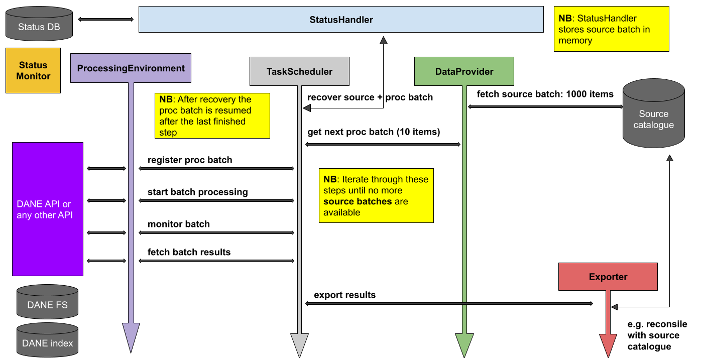

# Introduction

Python library for creating "processing workflows" that use [DANE environments](https://github.com/beeldengeluid/dane-environments), which in a nutshell offer, depending on the setup of each environment, an API for some kind of multi-media processing, e.g.:

* Automatic Speech Recognition
* Named Entity Extraction
* Computer Vision algorithms
* Any kind of Machine Learning algorithm

This Python library is however not limited to using [DANE](https://github.com/CLARIAH/DANE), but cannot also be used to hook up any API that does something with generating certain data from certain input data.

# Definition of a workflow

A workflow is able to iteratively:
- obtain input/source data from a `DataProvider`
- send it to a `ProcessingEnvironment` (e.g. DANE environment)
- wait for the processing environment to complete its work
- obtain results from the processing environment
- pass results to an `Exporter`, which typically reconsiles the processed data with the source data     

The following image illustrates the dane-workflows architecture:



# Getting started

## Prerequisites

* Python >= 3.8 <= 3.10
* [Poetry](https://python-poetry.org/)

## Installation

Run `poetry install`. After completion run:

```
poetry shell
```

To test the contents of this repository works well, run:

```
./scripts/check-project.sh
```

TODO finalise

# Usage

TODO (add example workflows to this repo, then write this)

# Roadmap

- [ ] Finalise initial README
- [ ] Implement more advanced recovery
- [ ] Add example workflows (refer in README)
- [ ] Add [Python docstring](https://www.askpython.com/python/python-docstring)

See the [open issues](https://github.com/beeldengeluid/dane-workflows/issues) for a full list of proposed features, known issues and user questions.

# This library

The structure of this library is as follows:

## TaskScheduler

Main process that handles all the steps described in the [Definition of a workflow]()

## StatusHandler

Keeps track of the workflow status, esuring recovery after crashes. By default the status is persisted to a SQLite database file, using the `SQLiteStatusHandler` but other implementations can be made by subclassing `StatusHandler`. 

## DataProvider

Iteratively called by the `TaskScheduler` to obtain a new batch of source data. No default implementations are available (yet), since there are many possible ways one would want to supply data to a system. Simply subclass from `DataProvider` to have full control over your input flow.

## ProcessingEnvironment

Iteratively called by the `TaskScheduler` to submit batches of data to an (external) processing environment. Also takes care of obtaining the output of finished processes from such an environment.

This library contains a full implementation, `DANEEnvironment`, for interacting with [DANE environments](https://github.com/beeldengeluid/dane-environments), but other environments/APIs can be supported by subclassing from `ProcessingEnvironment`.

## Exporter

Called by the `TaskScheduler` with output data from a processing environment. No default implementation is available (yet), since this is typically the most use-case sensitive part of any workflow, meaning you should decide what to do with the output data (by subclassing `Exporter`).


# License
Distributed under the MIT License. See `LICENSE.txt` for more information.


# Contact
Use the [issue tracker](https://github.com/beeldengeluid/dane-workflows/issues) for any questions concerning this repository

Project Link: https://github.com/beeldengeluid/dane-workflows
